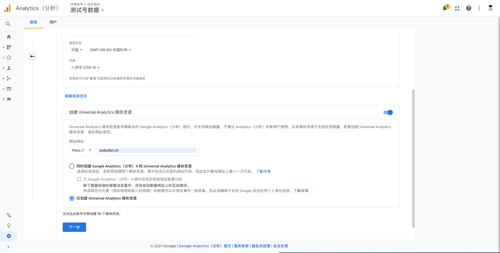
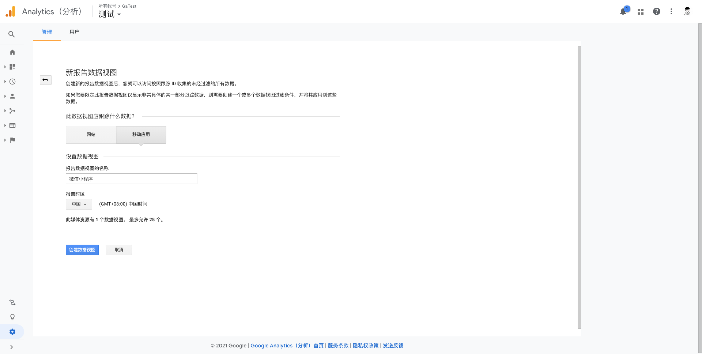

# 适用于UniApp和微信小程序的谷歌统计 (Google Analytics) SDK
完整实现了 [Measurement Protocol](https://developers.google.com/analytics/devguides/collection/protocol/v1/reference)，并且API接口和 [Google Analytics for Android](https://developers.google.com/analytics/devguides/collection/android/v4/) 保持高度一致。

## 快速入门

### Google Analytics 设置

> 新版已经不能直接创建`移动应用`类型的媒体资源了，因为选了`移动应用`就需要连接Firebase中的移动项目。

首先在你的账号下，创建一个新的媒体资源，并且点开`高级选项`，勾选`创建Universal Analytics`。



创建成功后，保存一下你的`跟踪id`。

然后在该媒体资源下新建数据视图，选择`移动应用`，然后将原来的默认视图删除。



### 安装

如果你使用`UniApp`框架开发的话，或者`WePY`、`mpVue`框架，可以使用`npm`进行安装。

```shell
npm install @ouduidui/ga-tracker
```

如果你使用微信小程序原生开发的话，即将[`ga.js`](https://github.com/OUDUIDUI/ga-tracker/releases)导入你的项目中。

### 合法域名

如果你是开发小程序的话，我们需要将上报域名设置为白名单。但是`www.google-analytics.com`域名没有国内备案，无法添加到微信小程序的`request合法域名`中。

因此你需要自己有一个已备案域名，然后用起或者二级域名去重定向到`www.google-analytics.com`。

> 如果只是本地开发测试，可以先不用设置，只要把开发工具里面`开发环境不校验请求域名以及 TLS 版本`勾选一下，等递交审核前再去设置合法域名。

具体方法：

1. 在跟踪器上设置自定义跟踪服务器 `tracker.setTrackerServer("https://ga-proxy.example.com")`
2. 修改域名`example.com`的DNS记录，将 `ga-proxy.example.com` 指向你自己的服务器IP
3. 自己服务器上的`nginx`做如下配置

```shell
upstream real_ga_servers {
        server www.google-analytics.com:443 weight=5 max_fails=0;
        keepalive 64;
}

server {    
   listen 443 ssl;
   server_name ga-proxy.example.com;
   
   ssl on;
   # 设置ssl证书（略）

    location / {

        # 告诉ga用户真实ip
        rewrite ^(.*)$   $1?uip=$remote_addr    break;
    
        proxy_set_header   Host       www.google-analytics.com;

        # Proxy to google-analytics.com
         proxy_buffering off;

        # 使用keepalive
         proxy_http_version 1.1; # require  nginx > 1.1.4
         proxy_set_header Connection ""; # for keepalive upstream

         proxy_pass https://real_ga_servers;
         proxy_redirect off;

    }
}
```

`ga-proxy.example.com` 的ssl证书配置请参考相关资料（这里略过）

另外，`www.google-analytics.com`国内有服务器，因此并不需要你的服务器有翻*墙能力就可以转发跟踪数据。

### 使用

> 下面的例子均为`uniapp`写法。

在`main.js`引入。

```js
import {GoogleAnalytics} from "@ouduidui/ga-tracker";

const gaTracker = {
    instance: null,
    getInstance() {
        if (!this.instance) {
            // 初始化GoogleAnalytics Tracker
            this.instance = GoogleAnalytics.getInstance() 
                .setAppName('UniApp')   // 设置名称
                .setAppVersion('1.0.0')   // 设置版本号
                .newTracker('UA-XXXXXX-X');  // 设置跟踪ID

            // #ifdef MP-WEIXIN
            // 使用自己的合法域名做跟踪数据转发
            this.instance.setTrackerServer("https://ga-proxy.example.com");
            // #endif
        }
        return this.instance;
    },
}

Vue.prototype.$gaTracker = gaTracker;
```

在`index.vue`中尝试一下简单的ScreenView统计。

```vue
<template>
	<view class="content">
		<image class="logo" src="/static/logo.png"></image>
		<view>
			<text class="title">{{title}}</text>
		</view>
	</view>
</template>

<script>
    import {HitBuilders}  from "@ouduidui/ga-tracker";

	export default {
		data() {
			return {
				title: 'Hello'
			}
		},
		onShow() {
		    // 设置屏幕名称
      	const t = this.$gaTracker.getInstance()
		    t.setScreenName('这是我的首屏页');
		    // 上报
		    t.send(new HitBuilders.ScreenViewBuilder().build());
		}
	}
</script>
```

此时已运行项目既可在`ga`中实时查看到。


## 功能特点

* 完整实现 [Measurement Protocol](https://developers.google.com/analytics/devguides/collection/protocol/v1/reference)
* 支持多个匹配数据批量上报
* 因为微信小程序只支持10个`wx.request`并发，为了不影响业务数据的网络请求，数据上报的时候按顺序进行，最多占用一个`wx.request`

## [API参考](./docs/api.md)

## 代码示例
